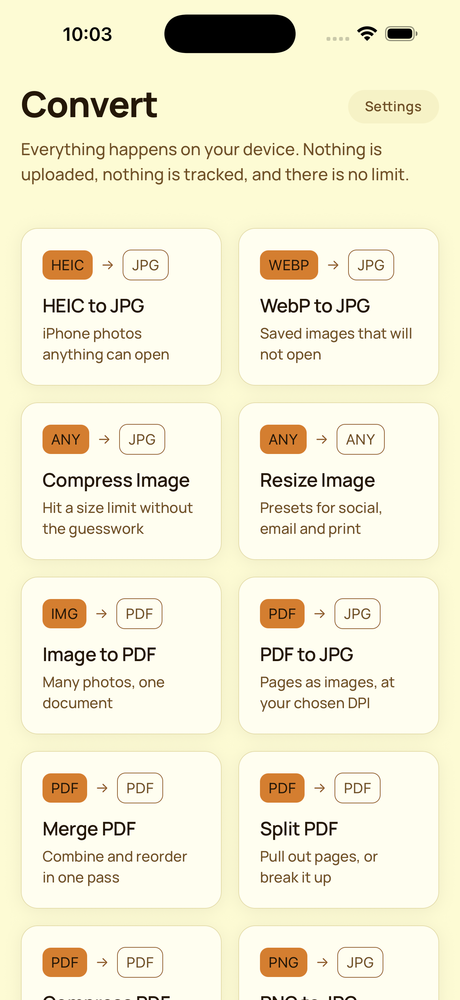
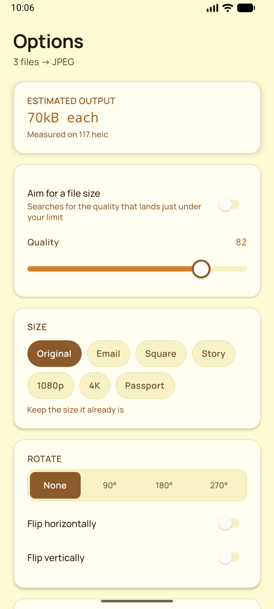
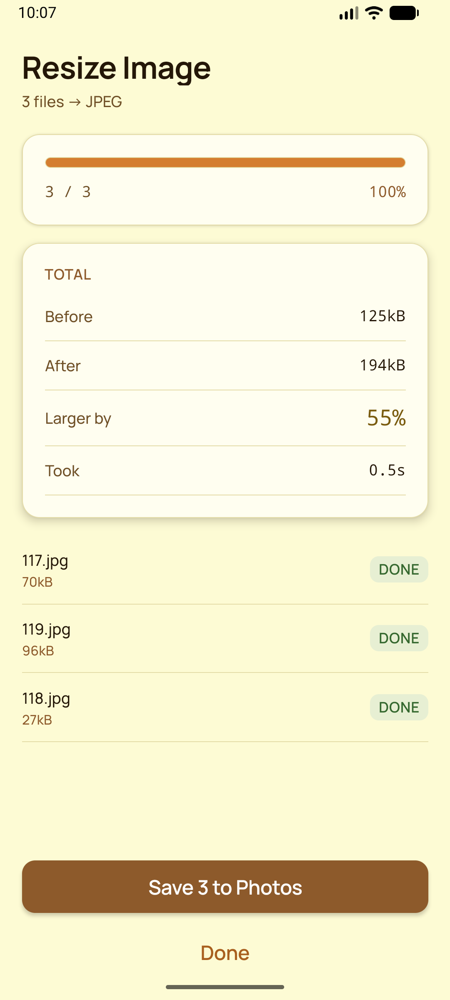
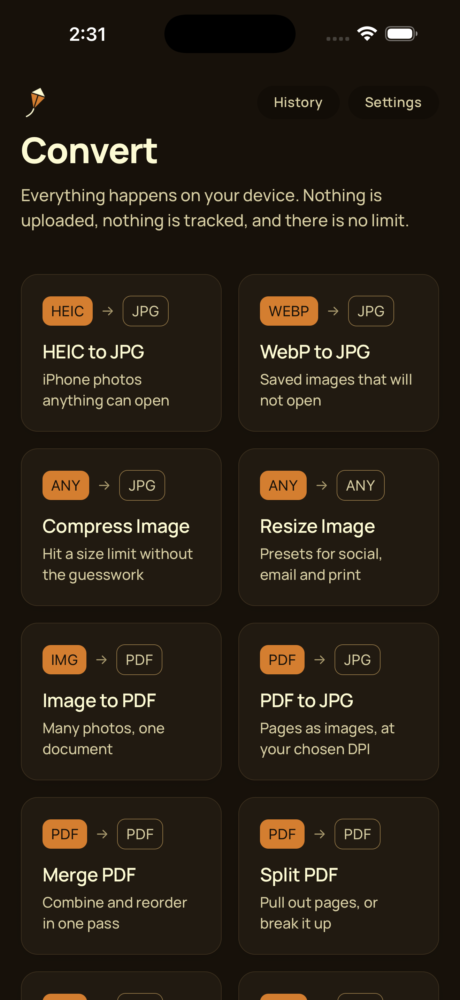
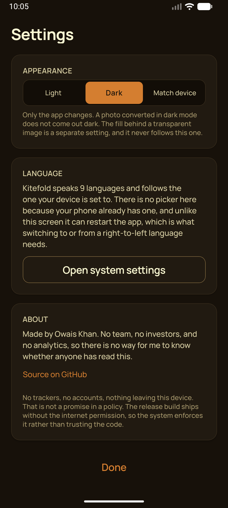

# Kitefold

A free, fast, 100% on-device image and document converter. HEIC to JPG, WebP, PDF in
both directions, batch conversion, resize and compress, with no uploads, no account
and no paywall.

Copyright (c) 2026 Owais Khan
Licensed under the Apache License, Version 2.0

---

## Screenshots

| Home | Options | Result |
|---|---|---|
|  |  |  |

| Appearance | Dark | Arabic |
|---|---|---|
|  |  |  |

Captured from release builds on an iPhone 17 Pro Max simulator and a Pixel-class Android
emulator. The full set, both platforms, is in
[`store/screenshots`](store/screenshots).

Two of these are doing more work than they look. The result card says **Larger by 55%**
because that is what happened: flat artwork encodes worse as JPEG than as PNG, and a
converter that reports 0% saved when a file grew is lying about the one number it exists to
report. And the Arabic screen is not the English one with the text swapped. The grid runs
right to left, the format badges trade places, and the arrow points the other way, because
an arrow that survives a mirror unchanged ends up pointing from the output back at the
input.

---

## What makes this different

Every competing converter is either a website that uploads your photos to someone
else's server, or an app that puts basic conversion behind a subscription. This one
does the work on the device, for free, with no limit.

That is a claim, so it is enforced rather than asserted:

| Claim | How it is enforced |
|---|---|
| No file ever leaves the device | Android release builds ship **without `android.permission.INTERNET`**, so the OS makes a network request impossible. A CI job asserts the permission is absent. |
| No tracking, no analytics | `npm run telemetry:check` fails the build if any ads, analytics or telemetry package appears in the dependency tree, transitively included. |
| "No data collected" on both stores | The generated iOS privacy manifest is verified in CI to declare no tracking and no collected data types. Crash reports come from Xcode Organizer and Play Console Vitals, which need no SDK. |
| One permission, asked once, refusable | The only runtime permission is `POST_NOTIFICATIONS`, requested on the first batch big enough to outlive the screen. It grants no access to any data, and refusing it does not stop a conversion. Android just does not draw the progress notification. iOS asks for nothing. |
| No copyleft dependency | `npm run license:check` fails on GPL, AGPL, LGPL, SSPL and non-commercial terms. |
| Accessible colour throughout | Every foreground/background pair in the design system is measured against WCAG AA by a test. |

---

## Requirements

| Tool | Version | Notes |
|---|---|---|
| Node | 24+ | The build scripts read TypeScript directly using Node's native type stripping. |
| Xcode | 16+ | iOS deployment target is 16.4, the floor React Native 0.86 supports. |
| CocoaPods | 1.15+ | |
| JDK | 17 or 21 | `brew install --cask temurin@17` |
| Android SDK | API 36 | Minimum supported device is API 26. |

This app **cannot run in Expo Go**, because it ships custom native code. Use a development
build.

### Two environment gotchas

**The project path must not contain a space.** React Native's own build scripts call
`find` with the project path unquoted, so a directory like `~/Desktop/PDF Editor` fails
during `pod install` with `find: /Users/…/PDF: No such file or directory`. This is a
React Native limitation, not something this project can work around. Move or rename the
checkout so the path has no spaces:

```bash
mv ~/Desktop/Projects/"PDF Editor" ~/Desktop/Projects/converter
```

**Xcode 26.1.1 needs a compatibility shim, which is applied automatically.** Expo SDK 57
uses Swift syntax (`weak let`, SE-0481) that the Swift 6.2.1 compiler in Xcode 26.1.1
does not implement, and calls `abs` in a way that is ambiguous under its C++ interop
mode. `scripts/patch-expo-toolchain.mjs` runs on `postinstall`, probes the toolchain,
and rewrites those two constructs in `expo-modules-jsi` only when needed. On a newer
Xcode it detects support and does nothing, so it removes itself without anyone having
to remember. If you update Xcode and the shim stops reporting, that is the expected
outcome.

## Getting started

```bash
npm install
npm run generate        # emit native token and format tables, and the app icons
npm run prebuild        # generate ios/ and android/ from app.json
npm run ios             # or: npm run android
```

Android needs both toolchain variables set:

```bash
export JAVA_HOME=/opt/homebrew/opt/openjdk@17
export ANDROID_HOME=$HOME/Library/Android/sdk
```

A debug APK carries every ABI and lands around 240 MB, which is enough to fail an
install on an emulator with a default disk. Build for the one architecture you are
running instead:

```bash
cd android && ./gradlew assembleDebug -PreactNativeArchitectures=arm64-v8a
```

`npm run verify` runs everything CI runs.

## Scripts

| Script | What it does |
|---|---|
| `npm run verify` | Typecheck, lint, generated-file freshness, licence gate, telemetry gate, tests |
| `npm run generate` | Regenerate `Tokens.swift`/`Tokens.kt` and `FormatTable.swift`/`FormatTable.kt` |
| `npm run tokens:check` | Fail if the generated token files are stale |
| `npm run formats:check` | Fail if the generated format tables are stale |
| `npm run license:report` | Regenerate `LICENSES.md` and run the licence gate |
| `npm run telemetry:check` | Fail if any data-collecting package is present |
| `npm test` | Jest |

---

## Architecture

The full document is [docs/ARCHITECTURE.md](docs/ARCHITECTURE.md). The short version:

**The batch queue lives in native code, not in JavaScript.** JavaScript submits one
declarative job and then only observes. It never loops over files, holds a buffer, or
schedules work. That single decision is what makes four things possible at once:

- **Converting while backgrounded.** iOS suspends the JavaScript runtime, so a
  JS-driven loop stalls mid-batch. A native queue under `beginBackgroundTask`, or an
  Android foreground service, does not.
- **A share extension that runs no JavaScript.** An iOS share extension has roughly a
  120 MB ceiling; booting React Native inside it is slow and risks being killed. A
  plain Swift class in a shared framework is neither.
- **Cancellation that actually cancels.** Only the owner of the operation objects can
  abort work already in flight.
- **A memory ceiling.** Per-file autorelease scoping and RAM-class-aware concurrency
  have to happen where the allocations happen.

```
JavaScript          features → store (zustand) → engine (capabilities, planner, jobClient)
                    ─────────── TurboModule boundary: JSON in, coalesced events out ───────────
ConverterCore       JobQueue · FormatDetector · RasterCodec · PdfEngine · FileGateway
                    ─────────── same framework, no JavaScript runtime ───────────
Peer clients        iOS Share Extension (Swift)      Android SEND target (Kotlin)
```

### Two sources of truth, compiled to three languages

`src/theme/tokens.ts` and `src/engine/formats.ts` are authored once and compiled into
Swift and Kotlin by `npm run generate`. The share extension and the Android share
target therefore render in the same design system and identify files by the same rules,
without a second copy of either table. CI fails if a generated file is stale.

### Nine languages, one catalogue

`src/i18n/locales/*.json` is the only place a user-visible string is written, including
the ones no JavaScript can reach. The Android foreground service runs while the runtime is
dead, and the iOS share extension runs none at all, so `plugins/withLocalizations.js`
compiles their resources out of the same files at prebuild: `values-xx/strings.xml`,
`xx.lproj/Localizable.strings`, and a `.stringsdict` for the plurals `.strings` cannot
express. A notification therefore cannot drift out of step with the screen that started it,
and the locale test covers both.

Plural forms come from the language, not from English. i18next resolves a count through
`Intl.PluralRules` and falls back to English when the category is missing, so a catalogue
carrying only `_one` and `_other` leaves an Arabic reader an English sentence for two, three
and eleven files, which is most of them. Each file carries exactly its own CLDR categories:
six for Arabic, three for the Romance languages, one for Japanese and Chinese. The test
asserts that per language rather than against English.

There is no in-app language picker, deliberately. iOS and Android both ship one, both
relaunch the app when it changes, which is what switching to or from a right-to-left
language requires, and a picker we built would be the one that could not. What the app owes
theirs is a declared list, which the same plugin writes as `CFBundleLocalizations` and
`res/xml/locales_config.xml`.

### The extension is a claim, not a fact

A `.png` that is really a HEIC is a real case, and a converter that believes the
filename produces an output byte-identical to its input. Every decision is made from
magic bytes. `src/engine/detect.ts` is the readable reference implementation; the native
detectors mirror it; a conformance test runs the fixture corpus through all three.

## Repository layout

```
src/
  native/      TurboModule specs and typed wrappers
  engine/      format table, detection, options schema, planner
  features/    home, convert, batch, options, pdf, incoming, history
  components/  design-system primitives, all token-driven
  store/       zustand slices
  theme/       tokens.ts, the contrast utility, the provider
  i18n/        the catalogue: nine locale files and the instance
  utils/
native/
  ios/ConverterCore/    Swift: ImageIO, PDFKit, vImage
  ios/generated/        Tokens.swift, FormatTable.swift
  android/converter/    Kotlin: ImageDecoder, PdfRenderer, PdfDocument
  android/generated/    Tokens.kt, FormatTable.kt
plugins/       Expo config plugins: native sources, share extension, localisations
scripts/       generators and CI gates
__tests__/     unit and integration
docs/          architecture, dependencies, measured contrast
```

`ios/` and `android/` are generated by `expo prebuild` and are not the home of any
hand-written code. Everything custom lives under `native/` and is applied during
prebuild, so `--clean` is always safe.

---

## Contributing

1. `npm run verify` must pass before a pull request.
2. **No colour literal outside `src/theme/tokens.ts`.** ESLint fails the build on a hex
   or `rgba()` value anywhere else. Colours written into converted image data, such as the
   background fill used when flattening transparency, live in `imageDefaults` and are
   deliberately outside the light and dark schemes, because a file converted in dark
   mode must not come out with a dark background.
3. **Adding a colour means updating `CONTRAST_CONTRACT`.** If a new pairing is not
   declared there, it is not checked.
4. **Adding a format means editing `src/engine/formats.ts` only.** Run
   `npm run formats:gen` and commit the generated tables.
5. **No dependency that collects data**, and none under a copyleft or non-commercial
   licence. Both gates run in CI.
6. Commit messages describe the change and why it was made.

## Releasing

`version` is what people read. `ios.buildNumber` and `android.versionCode` are what the
stores key uploads on, and both are written explicitly in `app.json` rather than left to
default.

That distinction is the point. Expo fills both in as `1` when they are absent, so a first
submission succeeds and nothing looks wrong. The second is rejected at upload, by a number
nobody chose and nobody can find in the config. Neither store lets a number be reused, and
it is spent whether or not the build was ever released, so there is no correcting it
afterwards.

Bump both together for every build you upload, keeping them equal, and let `version` change
only when the release is worth a new number to a user. A test asserts they are present, well
formed and in step.

    "version": "0.1.0",
    "ios":     { "buildNumber": "1" },
    "android": { "versionCode": 1 }

Signing is not in the repository and is not going to be. Both stores need credentials that
belong to the developer account, so an upload is the one step here that a person has to do.

---

## Licence

Apache License 2.0. See [LICENSE](LICENSE) and [NOTICE](NOTICE). Third-party licences
are inventoried in [LICENSES.md](LICENSES.md), regenerated by `npm run license:report`
and enforced in CI by `npm run license:check`.

An in-app licences screen is **not built yet**. This file used to claim there was one,
under Settings, which was wrong. Worth stating plainly rather than quietly deleting,
because conveying third-party notices with the binary is an obligation the repository
inventory does not discharge on its own. It is tracked for release.

## Colophon

Made by [Owais Khan](https://github.com/owaisazmal). No team, no investors, and no
analytics, which means I have no idea whether anyone has ever read this far, and no way
to find out. That is the deal, and I would take it again.

Source: **[github.com/owaisazmal/PDF-Editor](https://github.com/owaisazmal/PDF-Editor)**.
Public, and staying public.

No trackers, no accounts, no data collection, nothing leaving the device. That is not a
promise in a privacy policy. The release build ships without the `INTERNET` permission,
so if I ever had second thoughts, Android would refuse to let me act on them. There is no
server on the other end either, which makes it a short conversation.
